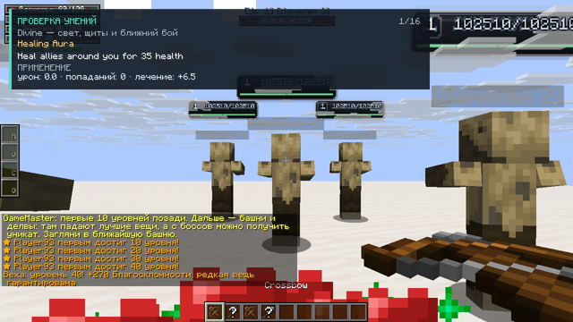
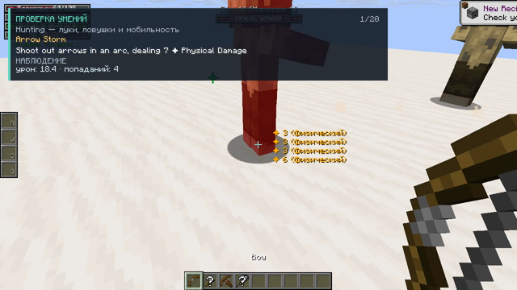
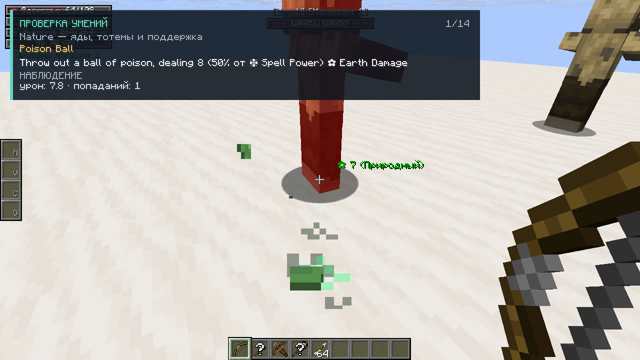
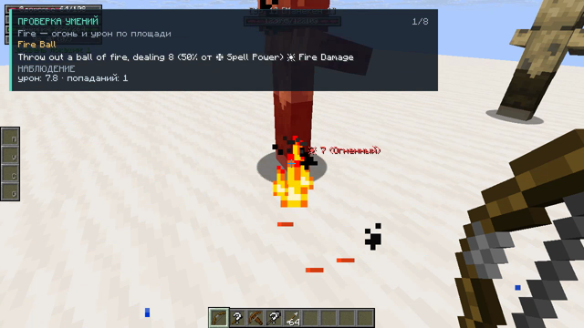
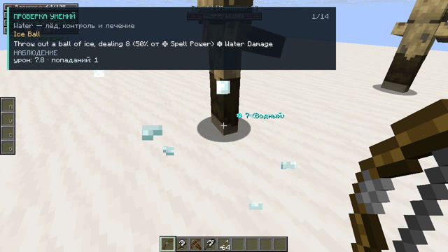
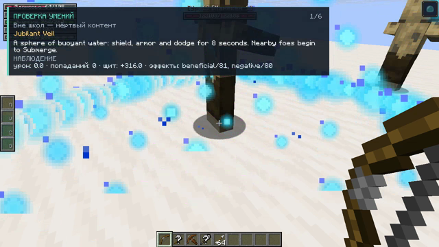

# Видео: применение всех умений по классам

Проверено умений: **78**, провалилось: **0**.

Каждый ролик — один класс. Подпись в кадре показывает название умения, его описание из тултипа и живые цифры: урон, попадания, лечение, эффекты и итог проверки.

| группа | ролик | умений |
|---|---|---|
| Divine | [divine.mp4](divine.mp4) | 16 |
| Hunting | [hunting.mp4](hunting.mp4) | 20 |
| Nature | [nature.mp4](nature.mp4) | 14 |
| Fire | [fire.mp4](fire.mp4) | 8 |
| Water | [water.mp4](water.mp4) | 14 |
| Вне школ | [no_school.mp4](no_school.mp4) | 6 |

## Divine — свет, щиты и ближний бой

[divine.mp4](divine.mp4) · [постер](divine.png)

| умение | итог | урон | попаданий | чем подтверждено |
|---|---|---|---|---|
| `healing_aura` | OK | 0.0 | 0 | лечение +8.0 · прим.: партиклы: клиентский визуал |
| `gong_strike` | OK | 9.7 | 1 | урон 9.7 (1 поп.) · эффекты: negative/11 · прим.: партиклы: клиентский визуал |
| `shout_warn` | OK | 0.0 | 0 | щит +5.0 · прим.: партиклы: клиентский визуал |
| `charge` | OK | 46.6 | 8 | урон 46.6 (8 поп.) · перемещение 0.4 бл. · прим.: партиклы: клиентский визуал |
| `whirlwind` | OK | 36.9 | 9 | урон 36.9 (9 поп.) · эффекты: knockback_resist · прим.: партиклы: клиентский визуал |
| `shooting_star` | OK | 0.0 | 0 | лечение +6.4 · прим.: партиклы: клиентский визуал |
| `undying_will` | OK | 0.0 | 0 | эффекты: beneficial/24 · прим.: партиклы: клиентский визуал |
| `pull` | OK | 19.4 | 5 | урон 19.4 (5 поп.) · эффекты: negative/11, slowness · прим.: партиклы: клиентский визуал; перемещение не замечено |
| `song_of_perseverance` | OK | 0.0 | 0 | эффекты: beneficial/19 · прим.: партиклы: клиентский визуал |
| `song_of_valor` | OK | 0.0 | 0 | эффекты: beneficial/18 · прим.: партиклы: клиентский визуал |
| `song_of_vigor` | OK | 0.0 | 0 | эффекты: beneficial/20 · прим.: партиклы: клиентский визуал |
| `awaken_mana` | OK | 0.0 | 0 | мана +173.6 · прим.: партиклы: клиентский визуал |
| `power_chord` | OK | 13.0 | 1 | урон 13.0 (1 поп.) · эффекты: negative/16 |
| `taunt` | OK | 0.0 | 0 | только каст: измеримых эффектов нет (агро/кулдаун/меню снаружи не видны) · прим.: партиклы: клиентский визуал |
| `banish` | OK | 0.0 | 0 | эффекты: negative/0 · прим.: партиклы: клиентский визуал; перемещение не замечено |
| `wish` | OK | 0.0 | 0 | лечение +8.0 · прим.: партиклы: клиентский визуал |

## Hunting — луки, ловушки и мобильность

[hunting.mp4](hunting.mp4) · [постер](hunting.png)

| умение | итог | урон | попаданий | чем подтверждено |
|---|---|---|---|---|
| `arrow_storm` | OK | 18.4 | 4 | урон 18.4 (4 поп.) · прим.: умение накладывается на выстрел из лука — прогон стреляет |
| `make_arrows` | OK | 0.0 | 0 | предметы +64 |
| `jump_field` | OK | 0.0 | 0 | перемещение 22.7 бл. |
| `dash` | OK | 0.0 | 0 | эффекты: slow_falling · перемещение 2.2 бл. |
| `hunter_potion` | OK | 0.0 | 0 | лечение +8.0 |
| `poison_arrow` | OK | 122.3 | 8 | урон 122.3 (8 поп.) · эффекты: negative/3, slowness · прим.: умение накладывается на выстрел из лука — прогон стреляет |
| `mark_for_death` | OK | 0.0 | 0 | эффекты: beneficial/31, knockback_resist, negative/18, glowing |
| `smoke_bomb` | OK | 0.0 | 0 | эффекты: negative/10 |
| `the_hunt` | OK | 0.0 | 0 | эффекты: night_vision, speed, glowing |
| `charged_bolt` | OK | 6.8 | 1 | урон 6.8 (1 поп.) · эффекты: slowness · прим.: умение накладывается на выстрел из лука — прогон стреляет |
| `shred` | OK | 7.8 | 2 | урон 7.8 (2 поп.) · эффекты: negative/19 |
| `recoil_shot` | OK | 16.5 | 1 | урон 16.5 (1 поп.) · эффекты: negative/4 · перемещение 4.2 бл. · прим.: умение накладывается на выстрел из лука — прогон стреляет |
| `backflip` | OK | 0.0 | 0 | эффекты: beneficial/30 · перемещение 8.4 бл. |
| `levitation` | OK | 0.0 | 0 | перемещение 0.7 бл. |
| `execute` | OK | 148.5 | 9 | урон 148.5 (9 поп.) |
| `fire_trap` | OK | 9.7 | 1 | урон 9.7 (1 поп.) |
| `frost_trap` | OK | 9.7 | 1 | урон 9.7 (1 поп.) |
| `poison_trap` | OK | 9.7 | 1 | урон 9.7 (1 поп.) |
| `night_vision` | OK | 0.0 | 0 | эффекты: night_vision |
| `explosive_arrow` | OK | 6.8 | 1 | урон 6.8 (1 поп.) · эффекты: slowness · прим.: умение накладывается на выстрел из лука — прогон стреляет |

## Nature — яды, тотемы и поддержка

[nature.mp4](nature.mp4) · [постер](nature.png)

| умение | итог | урон | попаданий | чем подтверждено |
|---|---|---|---|---|
| `poison_ball` | OK | 7.8 | 1 | урон 7.8 (1 поп.) |
| `poisoned_weapons` | OK | 0.0 | 0 | эффекты: beneficial/9 |
| `nature_balm` | OK | 0.0 | 0 | лечение +5.0 ×2 · эффекты: beneficial/5 |
| `thorn_armor` | OK | 0.0 | 0 | эффекты: beneficial/6 |
| `entangling_seed` | OK | 0.0 | 0 | эффекты: negative/1 |
| `rejuv_totem` | OK | 0.0 | 0 | лечение +8.0 ×6 |
| `astral_totem` | OK | 0.0 | 0 | мана +177.6 ×6 |
| `guard_totem` | OK | 0.0 | 0 | щит +156.0 |
| `poison_cloud` | OK | 104.8 | 6 | урон 104.8 (6 поп.) · эффекты: negative/3 |
| `curse_of_agony` | OK | 3.0 | 1 | урон 3.0 (1 поп.) · эффекты: negative/13 |
| `curse_of_weak` | OK | 3.0 | 1 | урон 3.0 (1 поп.) · эффекты: negative/14 |
| `curse_of_despair` | OK | 3.0 | 1 | урон 3.0 (1 поп.) · эффекты: negative/15 |
| `conjure_ender_chest` | OK | 0.0 | 0 | только каст: измеримых эффектов нет (агро/кулдаун/меню снаружи не видны) |
| `refresh` | OK | 0.0 | 0 | только каст: измеримых эффектов нет (агро/кулдаун/меню снаружи не видны) |

## Fire — огонь и урон по площади

[fire.mp4](fire.mp4) · [постер](fire.png)

| умение | итог | урон | попаданий | чем подтверждено |
|---|---|---|---|---|
| `fireball` | OK | 7.8 | 1 | урон 7.8 (1 поп.) |
| `flame_strike` | OK | 4.9 | 1 | урон 4.9 (1 поп.) |
| `fire_weapon` | OK | 0.0 | 0 | эффекты: beneficial/7 |
| `meteor` | OK | 16.5 | 1 | урон 16.5 (1 поп.) |
| `fire_nova` | OK | 33.0 | 2 | урон 33.0 (2 поп.) |
| `vamp_blood` | OK | 0.0 | 0 | эффекты: beneficial/3 |
| `draconic_blood` | OK | 0.0 | 0 | эффекты: beneficial/4 |
| `overload` | OK | 0.0 | 0 | эффекты: beneficial/17 |

## Water — лёд, контроль и лечение

[water.mp4](water.mp4) · [постер](water.png)

| умение | итог | урон | попаданий | чем подтверждено |
|---|---|---|---|---|
| `frostball` | OK | 7.8 | 1 | урон 7.8 (1 поп.) |
| `tidal_strike` | OK | 4.9 | 1 | урон 4.9 (1 поп.) |
| `frost_nova` | OK | 33.0 | 2 | урон 33.0 (2 поп.) |
| `frost_armor` | OK | 0.0 | 0 | эффекты: beneficial/14 |
| `water_breath` | OK | 0.0 | 0 | эффекты: water_breathing |
| `chilling_field` | OK | 17.5 | 6 | урон 17.5 (6 поп.) · эффекты: negative/2, beneficial/32 |
| `ice_weapon` | OK | 0.0 | 0 | эффекты: beneficial/10 |
| `ice_comet` | OK | 12.6 | 1 | урон 12.6 (1 поп.) |
| `chill_eruption` | OK | 49.5 | 3 | урон 49.5 (3 поп.) · прим.: подготовка: на манекены наложен mmorpg:negative/2 |
| `nourishment` | OK | 0.0 | 0 | эффекты: beneficial/2 |
| `mage_circle` | OK | 0.0 | 0 | эффекты: beneficial/33 · перемещение 2.2 бл. |
| `teleport` | OK | 0.0 | 0 | перемещение 2.2 бл. |
| `heart_of_ice` | OK | 0.0 | 0 | лечение +8.0 |
| `black_hole` | OK | 3.0 | 1 | урон 3.0 (1 поп.) · прим.: перемещение не замечено |

## Вне школ — заклинания, которые не выдают ни в одной школе

[no_school.mp4](no_school.mp4) · [постер](no_school.png)

| умение | итог | урон | попаданий | чем подтверждено |
|---|---|---|---|---|
| `jubilant_veil` | OK | 0.0 | 0 | щит +316.0 · эффекты: beneficial/81, negative/80 |
| `maelstrom_waltz` | OK | 415.7 | 23 | урон 415.7 (23 поп.) · эффекты: beneficial/32 · прим.: перемещение не замечено |
| `slipstream_surge` | OK | 19.4 | 2 | урон 19.4 (2 поп.) · эффекты: speed · перемещение 11.7 бл. |
| `tidewhip_lash` | OK | 78.4 | 3 | урон 78.4 (3 поп.) · эффекты: negative/80 |
| `unbound_joy` | OK | 0.0 | 0 | лечение +8.0 · эффекты: beneficial/80 |
| `undertow_grasp` | OK | 61.2 | 3 | урон 61.2 (3 поп.) · эффекты: negative/80 · прим.: перемещение не замечено |

